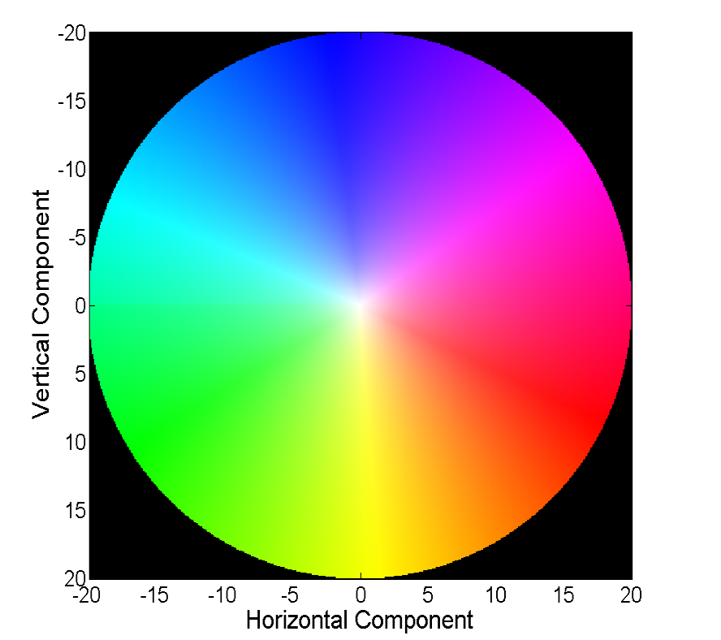

# optFlowVisualizer

>optical flow image visualizer

```python
%matplotlib inline
import flowlib

flow = flowlib.read_flo_file('./flow.flo')
#flowlib.save_flow_png(flow)
flowlib.mp_show(flow)
```



